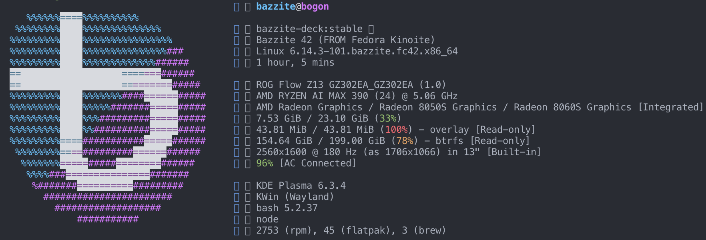

之前 [5090？Project DIGITS？Ryzen AI Max+ 395？有哪些想买的AI产品](https://mp.weixin.qq.com/s/IYgRPWDQ52UW6OXK7B-jQg) 简单聊过 AI MAX 395 这个APU。

作为AMD的第一代核显性能和独显打平的APU，我个人还是非常感兴趣，于是斥巨资买了一台幻x2025款。

因为不确定其除了LLM能力（绝大部分宣传稿提到的），在通用AI领域能力相比4060版本怎么样（比如生图、生成视频、跑各种AI库等等），所以买了个丐版先尝尝鲜。相比于395版本的满血40CU，丐版390的显卡核心为32CU，理论性能相差20%。



390-8050s

AI MAX 395满血TDP是120w左右，幻x只有90w手动模式，无法完全释放性能，而且有溢价。

所以真正比较实惠的还是买MINI主机版本，现在有很多厂商下场在做了，包括前几天已经开始发售的极摩客evo-x2，未来一两个月还会有fevm、零刻、玲珑等厂商做mini主机，这个性价比会高些。

# RTX 4060的性能

我们先看下4060的性能，4060比较特殊，笔记本和桌面端除了功耗上限外，硬件配置基本一致。

按照官方展示的算力来计算，列两个关键的指标：

- Tensor Core fp16算力，非稀疏，60.5 TFlops ，换算成FP8的话，翻个倍，而Cuda Core fp16的算力为 15.11 TFLOPS
- 带宽 272g/s 、TGP为115W


因为FP16是最常用的精度，就以FP16为准。虽然实际中tensor core和cuda core可以同时执行，但是理论算力不可能叠加（因为每个sm的资源限制，一般来说跑tensor core就没资源跑cuda core），所以这里按照4060最大tensor core算力来算，也就是60.5Tflops。

> 当然tensor core的适用性不如cuda core，因为目前现在大部分AI任务都是基于矩阵乘法，所以可以近似地按照这个算力来估算
> 

# AI MAX 395 / 390 介绍

AI MAX 395的核显为8060s和我这个丐版390的核显8050s，两者代号都为gfx1151，FP16算力分别是60 tflops 和45 tflops。

可以看到8060s的fp16算力基本和4060的fp16算力相当。

## 理论算力怎么来的

简单分析下，因为8060s基于RDNA3.5架构，和RDNA3的RX 7900架构基本一致，所以直接借用RDNA3的数据来分析：


8060s架构和RX7900基本一致

通过上表可以得到，核显中的 CU 每个周期可以执行 512 次fp16/bf16/INT8的乘加操作，1024次INT4的乘加操作。在最大时钟频率 2.9GHz 下，其峰值性能应为 59.4 FP16/BF16 TFLOPS，通过这个公式可以计算出来，接近60TFLOPS，和4060相当。

```
512 ops/clock/CU * 40 CU * 2.9e9 clock  / 1e12 = 59.392 FP16 TFLOPS
```

既然算力相当，那我们实际测测性能如何？

# AI MAX 395 核显分析

我这里的机器是8050s的幻x，安装fedora系统（另一个Linux发行版）为了更好实验。

然后基于这个仓库 https://github.com/ROCm/TheRock 去搭建rocm + HIP + pytorch环境，关于gfx1151有大佬已经提交过了fix代码，基本可以跑起来，还有些小bug，但不影响测试 按照 https://github.com/ROCm/TheRock/discussions/244 的步骤依次先执行构建命令：

```bash
 docker buildx build  --build-arg AMDGPU_TARGETS=gfx1151 -f dockerfiles/pytorch-dev/pytorch_dev_ubuntu_24.04.Dockerfile . --load  -t pytorch-rocm:v1
```

构建完后，使用该命令启动容器:

```bash
sudo docker run --device /dev/kfd --device /dev/dri  --security-opt seccomp=unconfined  -it pytorch-rocm:v1 bash
```

启动后pytorch已经安装好了，这里安装了前几周release的2.7版本，在强制开启HIPBLASLT后：

`export TORCH_BLAS_PREFER_HIPBLASLT=1`

我们测试下极限性能，使用 https://github.com/stas00/ml-engineering/tree/master/compute/accelerator提供的脚本测试： 

```bash
** Dtype: torch.bfloat16

** Platform/Device info:
Linux fe5b1b32a344 6.14.3-101.bazzite.fc42.x86_64 #1 SMP PREEMPT_DYNAMIC Wed Apr 23 13:07:40 UTC 2025 x86_64 x86_64
_CudaDeviceProperties(name='AMD Radeon Graphics', major=11, minor=5, gcnArchName='gfx1151', total_memory=11828MB, multi_processor_count=16, uuid=58580000-0000-0000-0000-000000000000, L2_cache_size=2MB)

** Critical software versions:
torch=2.7.0a0+git6537fd5
hip=6.5.25172-b42a9c664, cuda=None

** Additional notes:
benchmark version: 2

--------------------------------------------------------------------------------

Warming up the accelerator for 30 secs ... rocblaslt info: HIPBLASLT_TENSILE_LIBPATH not set: Using /opt/rocm/lib/hipblaslt/library
accelerator warmup finished
^C^C
Tried  879 shapes => the best outcomes were:
mean:   22.3 TFLOPS @ 3072x3072x1024 (MxNxK)
median: 22.3 TFLOPS @ 3072x3072x1024 (MxNxK)
max:    22.9 TFLOPS @ 3072x3072x1024 (MxNxK)

geomean: 16.5 TFLOPS for 879 shapes in range: m=[0, 16384, 1024] | n=[0, 16384, 1024] | k=[0, 16384, 1024]

Legend: TFLOPS = 10**12 FLOPS
Elapsed time: 0:49:39
```

测试的结果为23 Tflops，算是实际算力能达到的一个上限，8050s理论上为46tflops，达到了理论算力的 23/46=50%，

kernel优化AMD的有些差，作为对比，NV的cublas可以轻松达到理论算力的80%。

我这里的390并不是满血的核显，同时幻x的测试功耗从一开始的80w稳定到后来的65w也不是完全释放。那么满血的8060s性能如何，我们先简单估算下，首先需要确认性能提升是否和功耗成正相关，首先看下AI MAX 395这个APU的核显和功耗曲线图，可以看到核显从45w到120w都有性能提升，随着功耗越高、提升的幅度越小：


来自小明和他的女朋友的评测

按照上文得到的两个核显的算力结论：

- **AI MAX 390** 核显功耗 65 W 时测得 23 TFLOPS，
- **AI MAX 395** CU 数从 32 增至 40，理论上提升约 20%，
- AI MAX 395 目标功耗：120 W

我们可以通过建模的方式来推算下，因为性能随功耗并非线性增长，通常可近似建模为 $\text{Perf} \propto P^k,\quad k<1$，因为这里的经验中，k 多在 0.6–0.8 之间。

我们假设：

$F_{390}(65) = 23\;\mathrm{TFLOPS}$

$F_{395}(120) \approx F_{390}(65)\times 1.20 \times \Bigl(\tfrac{120}{65}\Bigr)^k$

- 1.20：CU 增加带来的理论提升
- $\bigl(120/65\bigr)^k$：功耗提升的亚线性增益

不同k值下

| k **值** | $\bigl(\tfrac{120}{65}\bigr)^k$ | **估算 TFLOPS =** $23\times1.20\times(120/65)^k$ |
| --- | --- | --- |
| 0.6 | $\approx1.359$ | $23\times1.20\times1.359\approx37.5 TFLOPS$ |
| 0.7 | $\approx1.536$ | $23\times1.20\times1.536\approx42.4 TFLOPS$ |
| 0.8 | $\approx1.737$ | $23\times1.20\times1.737\approx47.9 TFLOPS$ |
- 若 k 取中间值 ~0.7，则大约 40 TFLOPs，保守点就是37.5 TLOPs。
- 考虑系统其他开销（比如功率峰值处效率进一步下降，也就是上述图中到了90w核显的性能提升不明显了），取 0.6 左右范围更保守：也就是35-37 Ftops

所以在 120 W 峰值功耗下，AI MAX 395 的核显实际 FP16 TFLOPS 预计约 35-37 TFLOPS，典型可取 ≈36 TFLOPS。

---

不过正好B站UP主玲珑和秋月也测试了他们家的mini主机AI MAX 395系列，给出了一个数据36.2 Tflops，相比我这里的23 Tflops有 57%的性能提升，[另一个国外大佬测试出来是36.9Tflops](https://www.reddit.com/r/ROCm/comments/1kn2sa0/amd_strix_halo_ryzen_ai_max_395_gpu_llm/)，和上述的估算基本一致。


而4060的FP16理论算力是60.6 tflops，同时这个算力是Tensor Core算力，相比cuda core来说不是很通用，再算上实际kernel性能折损，打个折，也就和8060s核显的算力差不多了。

## 8060s支持的精度

> While RDNA 3 doesn't include dedicated execution units for AI acceleration like the Matrix Cores found in AMD's compute-focused [CDNA](https://en.wikipedia.org/wiki/CDNA_(microarchitecture)) architectures, the efficiency of running inference tasks on [FP16](https://en.wikipedia.org/wiki/Half-precision_floating-point_format) execution resources is improved with Wave MMA ([matrix](https://en.wikipedia.org/wiki/Matrix_multiplication) [multiply–accumulate](https://en.wikipedia.org/wiki/Multiply%E2%80%93accumulate_operation)) instructions. This results in increased inference performance compared to RDNA 2.[[15]](https://en.wikipedia.org/wiki/RDNA_3#cite_note-tomshw-rdna3-15)[[16]](https://en.wikipedia.org/wiki/RDNA_3#cite_note-tomshw-interview-16) WMMA supports FP16, BF16, INT8, and INT4 data types.[[17]](https://en.wikipedia.org/wiki/RDNA_3#cite_note-wmma-gpuopen-17) [*Tom's Hardware*](https://en.wikipedia.org/wiki/Tom%27s_Hardware) found that AMD's fastest RDNA 3 GPU, the RX 7900 XTX, was capable of generating 26 images per minute with [Stable Diffusion](https://en.wikipedia.org/wiki/Stable_Diffusion), compared to only 6.6 images per minute of the RX 6950 XT, the fastest RDNA 2 GPU.[[18]](https://en.wikipedia.org/wiki/RDNA_3#cite_note-tomshw-sd-18)
> 

因为8060s没有像4060那样有tensor core，所以有一些精度不支持，也没有像CDNA那样的专用AI加速单元（Matrix Cores）。

不过8060s可以通过Wave MMA（矩阵乘累加）指令提升了FP16运算效率，支持的数据类型包括FP16、BF16、INT8和INT4，比较细节的是，这里的INT8算力是和FP16一样的，而INT4的算力是FP16的两倍，有点奇怪。

## 目前已知的一些情况

不要高兴的太早，AMD目前的适配情况相比NVIDIA还是差很多滴：

- Pytorch和一部分基于pytorch的库可以跑通（比如transformers和triton），但是实际中有很多bug…
- 目前HIP 的 matmul 操作默认使用 rocBLAS，而非 hipBLASLt，所以rocBLAS 在 gfx1151 上表现非常糟糕，解决方案是设置环境变量 `export ROCBLAS_USE_HIPBLASLT=1` ，我上述测试的时候 `TORCH_BLAS_PREFER_HIPBLASLT` 开启也是这个原因
- **WMMA** 或 **Wave32 VOPD** 必须启用才能达到峰值，否则性能会减半，通用性不是很强。
- 带宽测试峰值 **212 GB/s**，接近 DDR5-8000 256-bit 总线的理论峰值 **256 GB/s**。
- CPU 到 GPU 的传输速率约 **84 GB/s**。


大模型推理vllm和一些生图生成视频的模型还没有测，等之后mini主机到了再测，算是未完待续。

# 结论省流版本

AI MAX 395的这个8060s核显，在最大TDP下的算力和RTX4060差不多，而且可以自定义超过110g的显存（在ubuntu系统下）。

不过就是软件适配比较差，HIP相比NVIDIA的cuda差的很远。所幸有其他的后端可以使用（Vulkan后端的性能接近M4 Max的表现），目前来说这个很适合搞AI的开发者去玩一玩。

对我来说这个相当于一个可以设置100g显存的、支持fp16精度（int8和int4虽然支持但是实际中不是很好用）的4060，软件上开发的不够完善需要自己折腾，如果折腾好了潜力还是蛮大的。

# 参考

- [https://zhuanlan.zhihu.com/p/640255727](https://zhuanlan.zhihu.com/p/640255727)
- [https://llvm.org/docs/AMDGPUUsage.html#memory-model-gfx12](https://llvm.org/docs/AMDGPUUsage.html#memory-model-gfx12)
- [https://zhuanlan.zhihu.com/p/631651468?utm_source=chatgpt.com](https://zhuanlan.zhihu.com/p/631651468?utm_source=chatgpt.com)
- [https://www.amd.com/en/products/processors/laptop/ryzen/ai-300-series/amd-ryzen-ai-max-plus-395.html](https://www.amd.com/en/products/processors/laptop/ryzen/ai-300-series/amd-ryzen-ai-max-plus-395.html)
- [https://en.wikipedia.org/wiki/RDNA_3#Integrated_graphics_processing_units_(iGPUs)](https://en.wikipedia.org/wiki/RDNA_3#Integrated_graphics_processing_units_(iGPUs))
- [https://github.com/likelovewant/ROCmLibs-for-gfx1103-AMD780M-APU?tab=readme-ov-file](https://github.com/likelovewant/ROCmLibs-for-gfx1103-AMD780M-APU?tab=readme-ov-file)
- [https://docs.docker.com/engine/install/fedora/](https://docs.docker.com/engine/install/fedora/)
- [https://docs.bazzite.gg/Installing_and_Managing_Software/rpm-ostree/](https://docs.bazzite.gg/Installing_and_Managing_Software/rpm-ostree/)
- [https://lanoc.org/review/video-cards/asus-dual-rtx-4060-8gb](https://lanoc.org/review/video-cards/asus-dual-rtx-4060-8gb)
- [https://zhuanlan.zhihu.com/p/640255727?utm_source=chatgpt.com](https://zhuanlan.zhihu.com/p/640255727?utm_source=chatgpt.com)
- [https://discuss.pytorch.org/t/slow-fp16-gemm-on-4090/200232](https://discuss.pytorch.org/t/slow-fp16-gemm-on-4090/200232)
- [https://gist.github.com/stefansundin/fa1c1dd7a60ebe2f8a2aa6d32631b119?utm_source=chatgpt.com](https://gist.github.com/stefansundin/fa1c1dd7a60ebe2f8a2aa6d32631b119?utm_source=chatgpt.com)
- [https://www.nvidia.com/en-sg/geforce/graphics-cards/compare/](https://www.nvidia.com/en-sg/geforce/graphics-cards/compare/)
- [https://www.answeroverflow.com/m/1316221468581036055](https://www.answeroverflow.com/m/1316221468581036055)
- [https://blog.machinezoo.com/Running_Ollama_on_AMD_iGPU](https://blog.machinezoo.com/Running_Ollama_on_AMD_iGPU)
- [https://www.hardware-corner.net/how-fast-ai-max-395-llm-20250317/](https://www.hardware-corner.net/how-fast-ai-max-395-llm-20250317/)
- [https://www.phoronix.com/forums/forum/linux-graphics-x-org-drivers/open-source-amd-linux/1466910-linux-6-10-improves-amd-rocm-compute-support-for-small-ryzen-apus?utm_source=chatgpt.com](https://www.phoronix.com/forums/forum/linux-graphics-x-org-drivers/open-source-amd-linux/1466910-linux-6-10-improves-amd-rocm-compute-support-for-small-ryzen-apus?utm_source=chatgpt.com)
- [https://www.zhihu.com/question/1887429972517438037/answer/130528712443](https://www.zhihu.com/question/1887429972517438037/answer/130528712443)
- http://reddit.com/r/ROCm/comments/1kn2sa0/amd_strix_halo_ryzen_ai_max_395_gpu_llm/
- [reddit.com/r/ROCm/comments/1kn2sa0/amd_strix_halo_ryzen_ai_max_395_gpu_llm/](http://reddit.com/r/ROCm/comments/1kn2sa0/amd_strix_halo_ryzen_ai_max_395_gpu_llm/)